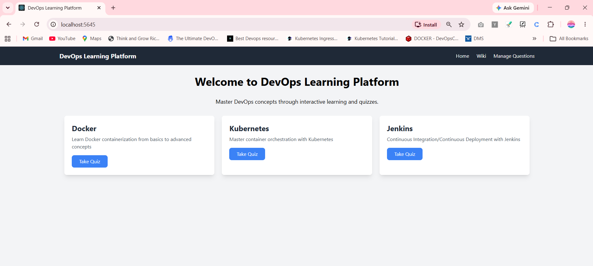
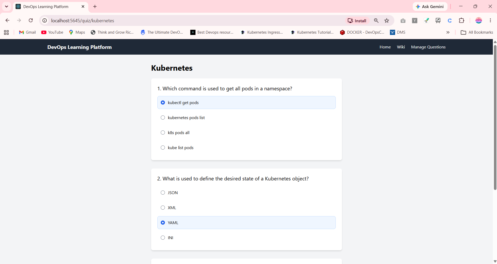
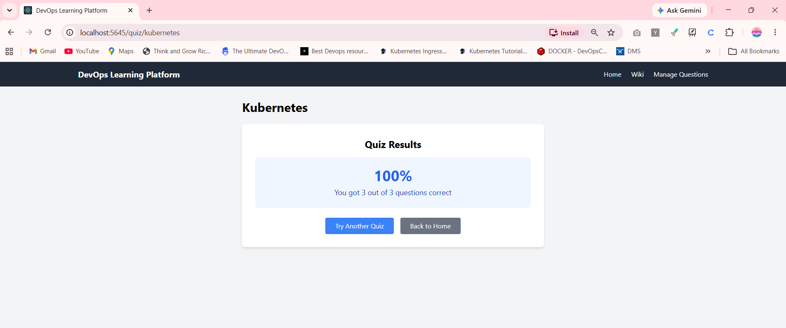
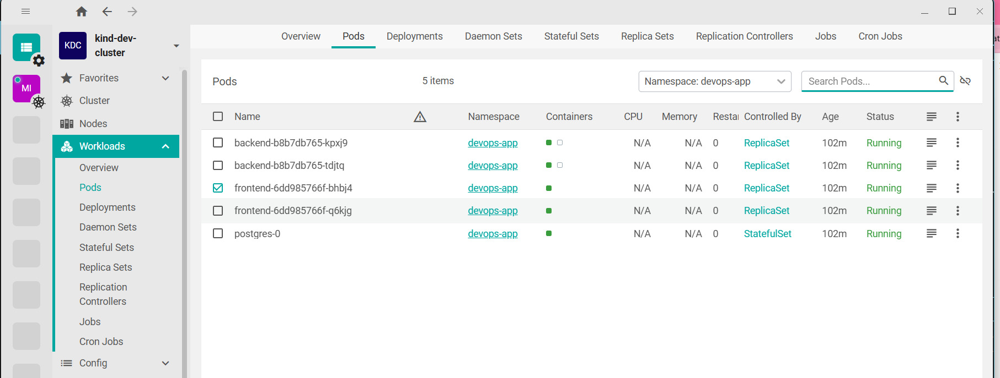

KAJAL@KAJAL MINGW64 /d/K8-Handson/DevOps-app (main)
$ kind create cluster --config kind-config.yaml --name dev-cluster
Creating cluster "dev-cluster" ...
 • Ensuring node image (kindest/node:v1.33.1) 🖼  ...
 ✓ Ensuring node image (kindest/node:v1.33.1) 🖼
 • Preparing nodes 📦 📦   ...
 ✓ Preparing nodes 📦 📦 
 • Writing configuration 📜  ...
 ✓ Writing configuration 📜
 • Starting control-plane 🕹️  ...
 ✓ Starting control-plane 🕹️
 • Installing CNI 🔌  ...
 ✓ Installing CNI 🔌
 • Installing StorageClass 💾  ...
 ✓ Installing StorageClass 💾
 • Joining worker nodes 🚜  ...
 ✓ Joining worker nodes 🚜
Set kubectl context to "kind-dev-cluster"
You can now use your cluster with:

kubectl cluster-info --context kind-dev-cluster

Thanks for using kind! 😊

KAJAL@KAJAL MINGW64 /d/K8-Handson/DevOps-app (main)
$ kubectl get nodes
NAME                        STATUS   ROLES           AGE   VERSION
dev-cluster-control-plane   Ready    control-plane   11m   v1.33.1
dev-cluster-worker          Ready    <none>          11m   v1.33.1

KAJAL@KAJAL MINGW64 /d/K8-Handson/DevOps-app (main)
$ kind load docker-image devops-frontend:local --name dev-cluster
Image: "devops-frontend:local" with ID "sha256:719cfe1d4b07e0eedf5c20639cdb10ee97a657c67097d0fd09fefafd9d911352" not yet present on node "dev-cluster-control-plane", loading...
Image: "devops-frontend:local" with ID "sha256:719cfe1d4b07e0eedf5c20639cdb10ee97a657c67097d0fd09fefafd9d911352" not yet present on node "dev-cluster-worker", loading...

KAJAL@KAJAL MINGW64 /d/K8-Handson/DevOps-app (main)
$ kind load docker-image devops-backend:local --name dev-cluster
Image: "devops-backend:local" with ID "sha256:cee6c686adcf996d281764623c52c682bcea768b6a2239d17ceaf957fe8cc996" not yet present on node "dev-cluster-control-plane", loading...
Image: "devops-backend:local" with ID "sha256:cee6c686adcf996d281764623c52c682bcea768b6a2239d17ceaf957fe8cc996" not yet present on node "dev-cluster-worker", loading...

KAJAL@KAJAL MINGW64 /d/K8-Handson/DevOps-app (main)
$ docker exec -it dev-cluster-control-plane crictl images | grep devops
docker.io/library/devops-backend                local                6c6f3b5d26123       177MB
docker.io/library/devops-frontend               local                4718e189f9675       168MB

KAJAL@KAJAL MINGW64 /d/K8-Handson/DevOps-app (main)
$ docker exec -it dev-cluster-worker crictl images | grep devops
docker.io/library/devops-backend                local                6c6f3b5d26123       177MB
docker.io/library/devops-frontend               local                4718e189f9675       168MB

KAJAL@KAJAL MINGW64 /d/K8-Handson/DevOps-app (main)
$ helm install devops-app ./devops-app --namespace devops-app --create-namespace
Error: INSTALLATION FAILED: path "./devops-app" not found

KAJAL@KAJAL MINGW64 /d/K8-Handson/DevOps-app (main)
$ cd app

KAJAL@KAJAL MINGW64 /d/K8-Handson/DevOps-app/app (main)
$ ls
backend/  frontend/

KAJAL@KAJAL MINGW64 /d/K8-Handson/DevOps-app/app (main)
$ cd backend

=====================================

KAJAL@KAJAL MINGW64 /d/K8-Handson/DevOps-app (main)
$ kubectl exec -it backend-b8b7db765-kpxj9 -n devops-app -- sh -c "ls /app"
Defaulted container "backend" out of: backend, wait-for-db (init)
Dockerfile   app                       migrate.sh  questions-answers  requirements.txt  seed_data.py
__pycache__  bulk_upload_questions.py  migrations  readme.md          run.py

KAJAL@KAJAL MINGW64 /d/K8-Handson/DevOps-app (main)
$ kubectl exec -it backend-b8b7db765-kpxj9 -n devops-app -- sh -c "flask db upgrade"
Defaulted container "backend" out of: backend, wait-for-db (init)
CORS allowing specific origins: ['https://akhileshmishra.tech', 'http://akhileshmishra.tech']
INFO  [alembic.runtime.migration] Context impl PostgresqlImpl.
INFO  [alembic.runtime.migration] Will assume transactional DDL.
INFO  [alembic.runtime.migration] Running upgrade  -> 52e9cadd17f8, Initial migration
INFO  [alembic.runtime.migration] Running upgrade 52e9cadd17f8 -> a05e32811b08, Add topics and questions tables

KAJAL@KAJAL MINGW64 /d/K8-Handson/DevOps-app (main)
$ kubectl exec -it backend-b8b7db765-kpxj9 -n devops-app -- sh -c "python seed_data.py"
Defaulted container "backend" out of: backend, wait-for-db (init)
CORS allowing specific origins: ['https://akhileshmishra.tech', 'http://akhileshmishra.tech']
Data seeded successfully!

KAJAL@KAJAL MINGW64 /d/K8-Handson/DevOps-app (main)
$ 