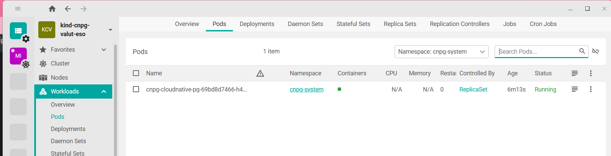
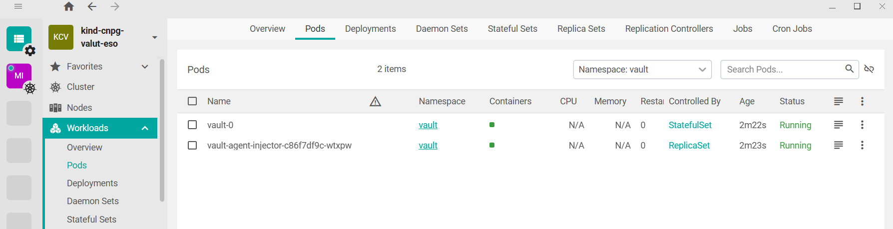
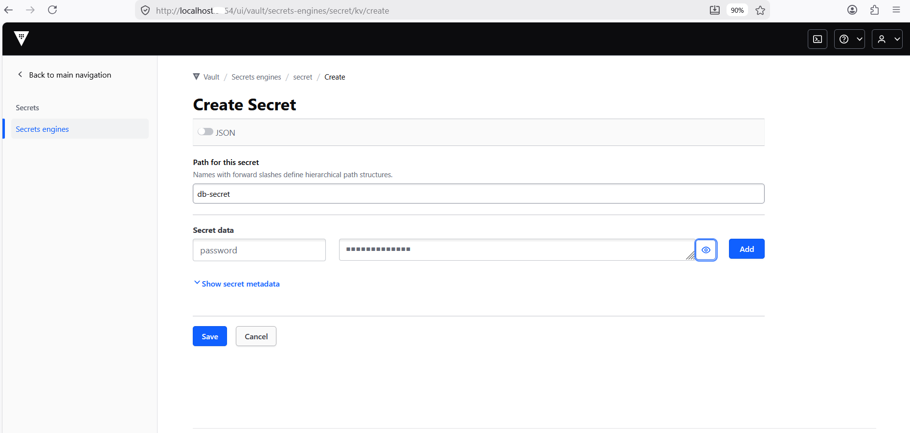
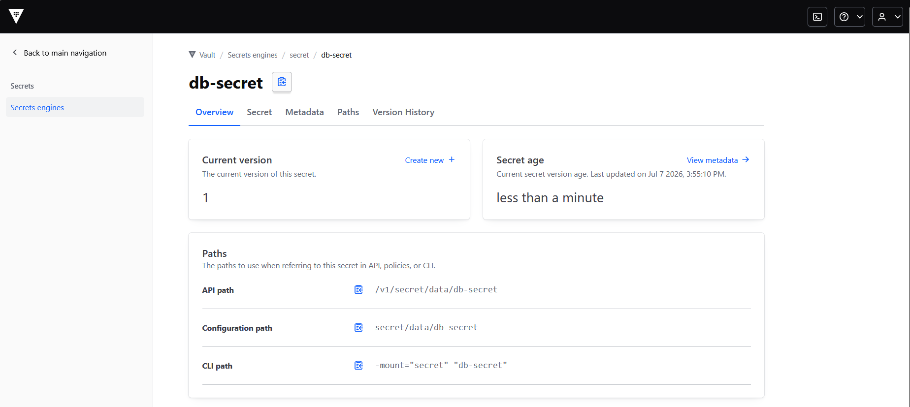
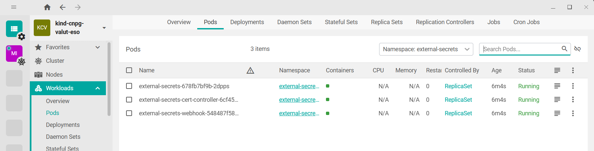

PS D:\K8-Handson\kind-cluster> helm repo list
NAME    URL                               
eks     https://aws.github.io/eks-charts  
bitnami https://charts.bitnami.com/bitnami
PS D:\K8-Handson\kind-cluster> helm repo add cnpg https://cloudnative-pg.github.io/charts
"cnpg" has been added to your repositories
PS D:\K8-Handson\kind-cluster> helm repo update
Hang tight while we grab the latest from your chart repositories...
...Successfully got an update from the "eks" chart repository
...Successfully got an update from the "cnpg" chart repository
...Successfully got an update from the "bitnami" chart repository
Update Complete. ⎈Happy Helming!⎈

KAJAL@KAJAL MINGW64 /d/K8-Handson (main)
$ cd kind-cluster

KAJAL@KAJAL MINGW64 /d/K8-Handson/kind-cluster (main)
$ helm upgrade --install cnpg cnpg/cloudnative-pg \
  --namespace cnpg-system \
  --create-namespace
Release "cnpg" does not exist. Installing it now.
NAME: cnpg
LAST DEPLOYED: Tue Jul  7 15:04:19 2026
NAMESPACE: cnpg-system
STATUS: deployed
REVISION: 1
TEST SUITE: None
NOTES:
CloudNativePG operator should be installed in namespace "cnpg-system".
You can now create a PostgreSQL cluster with 3 nodes as follows:

cat <<EOF | kubectl apply -f -
# Example of PostgreSQL cluster
apiVersion: postgresql.cnpg.io/v1
kind: Cluster
metadata:
  name: cluster-example
  
spec:
  instances: 3
  storage:
    size: 1Gi
EOF

kubectl get -A cluster

KAJAL@KAJAL MINGW64 /d/K8-Handson/kind-cluster (main)
$ kubectl get crds | grep postgresql
backups.postgresql.cnpg.io                2026-07-07T09:34:22Z
clusterimagecatalogs.postgresql.cnpg.io   2026-07-07T09:34:22Z
clusters.postgresql.cnpg.io               2026-07-07T09:34:22Z
databaseroles.postgresql.cnpg.io          2026-07-07T09:34:22Z
databases.postgresql.cnpg.io              2026-07-07T09:34:22Z
failoverquorums.postgresql.cnpg.io        2026-07-07T09:34:22Z
imagecatalogs.postgresql.cnpg.io          2026-07-07T09:34:22Z
poolers.postgresql.cnpg.io                2026-07-07T09:34:22Z
publications.postgresql.cnpg.io           2026-07-07T09:34:22Z
scheduledbackups.postgresql.cnpg.io       2026-07-07T09:34:22Z
subscriptions.postgresql.cnpg.io          2026-07-07T09:34:22Z

KAJAL@KAJAL MINGW64 /d/K8-Handson/kind-cluster (main)
$ kubectl get pods -n cnpg-system
NAME                                   READY   STATUS    RESTARTS   AGE
cnpg-cloudnative-pg-69bd8d7466-h4hrl   1/1     Running   0          38s

KAJAL@KAJAL MINGW64 /d/K8-Handson/kind-cluster (main)
$ kubectl api-resources | grep cnpg
backups                                          postgresql.cnpg.io/v1             true         Backup
clusterimagecatalogs                             postgresql.cnpg.io/v1             false        ClusterImageCatalog
clusters                                         postgresql.cnpg.io/v1             true         Cluster
databaseroles                                    postgresql.cnpg.io/v1             true         DatabaseRole
databases                                        postgresql.cnpg.io/v1             true         Database
failoverquorums                                  postgresql.cnpg.io/v1             true         FailoverQuorum
imagecatalogs                                    postgresql.cnpg.io/v1             true         ImageCatalog
poolers                                          postgresql.cnpg.io/v1             true         Pooler
publications                                     postgresql.cnpg.io/v1             true         Publication
scheduledbackups                                 postgresql.cnpg.io/v1             true         ScheduledBackup
subscriptions                                    postgresql.cnpg.io/v1             true         Subscription

======================================================

KAJAL@KAJAL MINGW64 /d/K8-Handson/kind-cluster (main)
$ kubectl apply -f cluster.yaml
cluster.postgresql.cnpg.io/pg-cluster created

KAJAL@KAJAL MINGW64 /d/K8-Handson/kind-cluster (main)
$ kubectl get cluster pg-cluster -w
NAME         AGE     INSTANCES   READY   STATUS               PRIMARY
pg-cluster   2m19s   1                   Setting up primary   

KAJAL@KAJAL MINGW64 /d/K8-Handson/kind-cluster (main)
$ 

KAJAL@KAJAL MINGW64 /d/K8-Handson/kind-cluster (main)
$ kubectl get pods -l cnpg.io/cluster=pg-cluster -w
NAME                        READY   STATUS            RESTARTS   AGE
pg-cluster-1-initdb-mvd5n   0/1     PodInitializing   0          2m40s

KAJAL@KAJAL MINGW64 /d/K8-Handson/kind-cluster (main)
$ kubectl get pvc
NAME           STATUS   VOLUME                                     CAPACITY   ACCESS MODES   STORAGECLASS   VOLUMEATTRIBUTESCLASS   AGE
pg-cluster-1   Bound    pvc-ffa2d349-c2c3-432a-a0ec-fd8a6b99e2f9   1Gi        RWO            standard       <unset>                 3m56s

KAJAL@KAJAL MINGW64 /d/K8-Handson/kind-cluster (main)
$ kubectl get svc
NAME            TYPE        CLUSTER-IP     EXTERNAL-IP   PORT(S)    AGE
kubernetes      ClusterIP   10.96.0.1      <none>        443/TCP    21m
pg-cluster-r    ClusterIP   10.96.53.175   <none>        5432/TCP   4m7s
pg-cluster-ro   ClusterIP   10.96.67.45    <none>        5432/TCP   4m7s
pg-cluster-rw   ClusterIP   10.96.40.82    <none>        5432/TCP   4m7s

KAJAL@KAJAL MINGW64 /d/K8-Handson/kind-cluster (main)
$ kubectl get secrets | grep pg-cluster
pg-cluster-app           kubernetes.io/basic-auth   11     4m25s
pg-cluster-ca            Opaque                     2      4m25s
pg-cluster-replication   kubernetes.io/tls          2      4m25s
pg-cluster-server        kubernetes.io/tls          2      4m25s

KAJAL@KAJAL MINGW64 /d/K8-Handson/kind-cluster (main)
$ kubectl get pods -l cnpg.io/cluster=pg-cluster -w
NAME                        READY   STATUS            RESTARTS   AGE
pg-cluster-1-initdb-mvd5n   0/1     PodInitializing   0          9m26s

KAJAL@KAJAL MINGW64 /d/K8-Handson/kind-cluster (main)
$ kubectl describe po pg-cluster-1-initdb-mvd5n
Name:             pg-cluster-1-initdb-mvd5n
Namespace:        default
Priority:         0
Service Account:  pg-cluster
Node:             cnpg-valut-eso-worker/172.18.0.3
Start Time:       Tue, 07 Jul 2026 15:17:55 +0530
Labels:           app.kubernetes.io/component=database
                  app.kubernetes.io/instance=pg-cluster
                  app.kubernetes.io/managed-by=cloudnative-pg
                  app.kubernetes.io/name=postgresql
                  app.kubernetes.io/version=18
                  batch.kubernetes.io/controller-uid=24ae09cf-2248-490d-91c5-2fd90b7b6c9f
                  batch.kubernetes.io/job-name=pg-cluster-1-initdb
                  cnpg.io/cluster=pg-cluster
                  cnpg.io/instanceName=pg-cluster-1
                  cnpg.io/jobRole=initdb
                  controller-uid=24ae09cf-2248-490d-91c5-2fd90b7b6c9f
                  job-name=pg-cluster-1-initdb
Annotations:      cnpg.io/operatorVersion: 1.30.0
Status:           Pending
SeccompProfile:   RuntimeDefault
IP:               10.244.1.3
IPs:
  IP:           10.244.1.3
Controlled By:  Job/pg-cluster-1-initdb
Init Containers:
  bootstrap-controller:
    Container ID:    containerd://253865bdb472f22d8d28c500b814c24baa389cd9a56eac336f3976415e1e021b
    Image:           ghcr.io/cloudnative-pg/cloudnative-pg:1.30.0
    Image ID:        ghcr.io/cloudnative-pg/cloudnative-pg@sha256:a2701eb97cdd2a34b1fdb2cb51987f544b706e40bec72ae7146cd8580efefebb
    Port:            <none>
    Host Port:       <none>
    SeccompProfile:  RuntimeDefault
    Command:
      /manager
      bootstrap
      /controller/manager
      --log-level=info
    State:          Terminated
      Reason:       Completed
      Exit Code:    0
      Started:      Tue, 07 Jul 2026 15:18:26 +0530
      Finished:     Tue, 07 Jul 2026 15:18:29 +0530
    Ready:          True
    Restart Count:  0
    Environment:    <none>
    Mounts:
      /controller from scratch-data (rw)
      /dev/shm from shm (rw)
      /run from scratch-data (rw)
      /var/lib/postgresql/data from pgdata (rw)
      /var/run/secrets/kubernetes.io/serviceaccount from kube-api-access-25qzm (ro)
Containers:
  initdb:
    Container ID:    
    Image:           ghcr.io/cloudnative-pg/postgresql:18.4-system-trixie
    Image ID:        
    Port:            <none>
    Host Port:       <none>
    SeccompProfile:  RuntimeDefault
    Command:
      /controller/manager
      instance
      init
      --initdb-flags
      --encoding=UTF8 --lc-collate=C --lc-ctype=C
      --app-db-name
      app
      --app-user
      app
      --log-level=info
    State:          Waiting
      Reason:       PodInitializing
    Ready:          False
    Restart Count:  0
    Environment:
      PGDATA:        /var/lib/postgresql/data/pgdata
      POD_NAME:      pg-cluster-1-initdb
      NAMESPACE:     default
      CLUSTER_NAME:  pg-cluster
      PSQL_HISTORY:  /controller/tmp/.psql_history
      PGPORT:        5432
      PGHOST:        /controller/run
      TMPDIR:        /controller/tmp
      APP_USERNAME:  <set to the key 'username' in secret 'pg-cluster-app'>  Optional: false
    Mounts:
      /controller from scratch-data (rw)
      /dev/shm from shm (rw)
      /run from scratch-data (rw)
      /var/lib/postgresql/data from pgdata (rw)
      /var/run/secrets/kubernetes.io/serviceaccount from kube-api-access-25qzm (ro)
Conditions:
  Type                        Status
  PodReadyToStartContainers   True 
  Initialized                 True 
  Ready                       False 
  ContainersReady             False 
  PodScheduled                True 
Volumes:
  pgdata:
    Type:       PersistentVolumeClaim (a reference to a PersistentVolumeClaim in the same namespace)
    ClaimName:  pg-cluster-1
    ReadOnly:   false
  scratch-data:
    Type:       EmptyDir (a temporary directory that shares a pod's lifetime)
    Medium:     
    SizeLimit:  <unset>
  shm:
    Type:       EmptyDir (a temporary directory that shares a pod's lifetime)
    Medium:     Memory
    SizeLimit:  <unset>
  kube-api-access-25qzm:
    Type:                    Projected (a volume that contains injected data from multiple sources)
    TokenExpirationSeconds:  3607
    ConfigMapName:           kube-root-ca.crt
    ConfigMapOptional:       <nil>
    DownwardAPI:             true
QoS Class:                   BestEffort
Node-Selectors:              <none>
Tolerations:                 node.kubernetes.io/not-ready:NoExecute op=Exists for 300s
                             node.kubernetes.io/unreachable:NoExecute op=Exists for 300s
Events:
  Type    Reason     Age   From               Message
  ----    ------     ----  ----               -------
  Normal  Scheduled  11m   default-scheduler  Successfully assigned default/pg-cluster-1-initdb-mvd5n to cnpg-valut-eso-worker
  Normal  Pulling    11m   kubelet            Pulling image "ghcr.io/cloudnative-pg/cloudnative-pg:1.30.0"
  Normal  Pulled     10m   kubelet            Successfully pulled image "ghcr.io/cloudnative-pg/cloudnative-pg:1.30.0" in 28.255s (28.255s including waiting). Image size: 37160203 bytes.
  Normal  Created    10m   kubelet            Created container: bootstrap-controller
  Normal  Started    10m   kubelet            Started container bootstrap-controller
  Normal  Pulling    10m   kubelet            Pulling image "ghcr.io/cloudnative-pg/postgresql:18.4-system-trixie"

KAJAL@KAJAL MINGW64 /d/K8-Handson/kind-cluster (main)
$ kubectl get pvc
NAME           STATUS   VOLUME                                     CAPACITY   ACCESS MODES   STORAGECLASS   VOLUMEATTRIBUTESCLASS   AGE
pg-cluster-1   Bound    pvc-ffa2d349-c2c3-432a-a0ec-fd8a6b99e2f9   1Gi        RWO            standard       <unset>                 12m

KAJAL@KAJAL MINGW64 /d/K8-Handson/kind-cluster (main)
$ kubectl describe pod pg-cluster-1-initdb-mvd5n
Name:             pg-cluster-1-initdb-mvd5n
Namespace:        default
Priority:         0
Service Account:  pg-cluster
Node:             cnpg-valut-eso-worker/172.18.0.3
Start Time:       Tue, 07 Jul 2026 15:17:55 +0530
Labels:           app.kubernetes.io/component=database
                  app.kubernetes.io/instance=pg-cluster
                  app.kubernetes.io/managed-by=cloudnative-pg
                  app.kubernetes.io/name=postgresql
                  app.kubernetes.io/version=18
                  batch.kubernetes.io/controller-uid=24ae09cf-2248-490d-91c5-2fd90b7b6c9f
                  batch.kubernetes.io/job-name=pg-cluster-1-initdb
                  cnpg.io/cluster=pg-cluster
                  cnpg.io/instanceName=pg-cluster-1
                  cnpg.io/jobRole=initdb
                  controller-uid=24ae09cf-2248-490d-91c5-2fd90b7b6c9f
                  job-name=pg-cluster-1-initdb
Annotations:      cnpg.io/operatorVersion: 1.30.0
Status:           Running
SeccompProfile:   RuntimeDefault
IP:               10.244.1.3
IPs:
  IP:           10.244.1.3
Controlled By:  Job/pg-cluster-1-initdb
Init Containers:
  bootstrap-controller:
    Container ID:    containerd://253865bdb472f22d8d28c500b814c24baa389cd9a56eac336f3976415e1e021b
    Image:           ghcr.io/cloudnative-pg/cloudnative-pg:1.30.0
    Image ID:        ghcr.io/cloudnative-pg/cloudnative-pg@sha256:a2701eb97cdd2a34b1fdb2cb51987f544b706e40bec72ae7146cd8580efefebb
    Port:            <none>
    Host Port:       <none>
    SeccompProfile:  RuntimeDefault
    Command:
      /manager
      bootstrap
      /controller/manager
      --log-level=info
    State:          Terminated
      Reason:       Completed
      Exit Code:    0
      Started:      Tue, 07 Jul 2026 15:18:26 +0530
      Finished:     Tue, 07 Jul 2026 15:18:29 +0530
    Ready:          True
    Restart Count:  0
    Environment:    <none>
    Mounts:
      /controller from scratch-data (rw)
      /dev/shm from shm (rw)
      /run from scratch-data (rw)
      /var/lib/postgresql/data from pgdata (rw)
      /var/run/secrets/kubernetes.io/serviceaccount from kube-api-access-25qzm (ro)
Containers:
  initdb:
    Container ID:    containerd://aa018819f73316527c8d1541f17b619d5f019e3d469d87f5573c5a2474b44e19
    Image:           ghcr.io/cloudnative-pg/postgresql:18.4-system-trixie
    Image ID:        ghcr.io/cloudnative-pg/postgresql@sha256:b2c03bf5c6f8bc16495aacc0bb0765c77fe3e8ce6bc94ade26958f62ab9b4a14
    Port:            <none>
    Host Port:       <none>
    SeccompProfile:  RuntimeDefault
    Command:
      /controller/manager
      instance
      init
      --initdb-flags
      --encoding=UTF8 --lc-collate=C --lc-ctype=C
      --app-db-name
      app
      --app-user
      app
      --log-level=info
    State:          Running
      Started:      Tue, 07 Jul 2026 15:32:23 +0530
    Ready:          True
    Restart Count:  0
    Environment:
      PGDATA:        /var/lib/postgresql/data/pgdata
      POD_NAME:      pg-cluster-1-initdb
      NAMESPACE:     default
      CLUSTER_NAME:  pg-cluster
      PSQL_HISTORY:  /controller/tmp/.psql_history
      PGPORT:        5432
      PGHOST:        /controller/run
      TMPDIR:        /controller/tmp
      APP_USERNAME:  <set to the key 'username' in secret 'pg-cluster-app'>  Optional: false
    Mounts:
      /controller from scratch-data (rw)
      /dev/shm from shm (rw)
      /run from scratch-data (rw)
      /var/lib/postgresql/data from pgdata (rw)
      /var/run/secrets/kubernetes.io/serviceaccount from kube-api-access-25qzm (ro)
Conditions:
  Type                        Status
  PodReadyToStartContainers   True 
  Initialized                 True 
  Ready                       True 
  ContainersReady             True 
  PodScheduled                True 
Volumes:
  pgdata:
    Type:       PersistentVolumeClaim (a reference to a PersistentVolumeClaim in the same namespace)
    ClaimName:  pg-cluster-1
    ReadOnly:   false
  scratch-data:
    Type:       EmptyDir (a temporary directory that shares a pod's lifetime)
    Medium:     
    SizeLimit:  <unset>
  shm:
    Type:       EmptyDir (a temporary directory that shares a pod's lifetime)
    Medium:     Memory
    SizeLimit:  <unset>
  kube-api-access-25qzm:
    Type:                    Projected (a volume that contains injected data from multiple sources)
    TokenExpirationSeconds:  3607
    ConfigMapName:           kube-root-ca.crt
    ConfigMapOptional:       <nil>
    DownwardAPI:             true
QoS Class:                   BestEffort
Node-Selectors:              <none>
Tolerations:                 node.kubernetes.io/not-ready:NoExecute op=Exists for 300s
                             node.kubernetes.io/unreachable:NoExecute op=Exists for 300s
Events:
  Type    Reason     Age   From               Message
  ----    ------     ----  ----               -------
  Normal  Scheduled  14m   default-scheduler  Successfully assigned default/pg-cluster-1-initdb-mvd5n to cnpg-valut-eso-worker
  Normal  Pulling    14m   kubelet            Pulling image "ghcr.io/cloudnative-pg/cloudnative-pg:1.30.0"
  Normal  Pulled     14m   kubelet            Successfully pulled image "ghcr.io/cloudnative-pg/cloudnative-pg:1.30.0" in 28.255s (28.255s including waiting). Image size: 37160203 bytes.
  Normal  Created    14m   kubelet            Created container: bootstrap-controller
  Normal  Started    14m   kubelet            Started container bootstrap-controller
  Normal  Pulling    14m   kubelet            Pulling image "ghcr.io/cloudnative-pg/postgresql:18.4-system-trixie"
  Normal  Pulled     11s   kubelet            Successfully pulled image "ghcr.io/cloudnative-pg/postgresql:18.4-system-trixie" in 13m52.554s (13m52.555s including waiting). Image size: 273987868 bytes.
  Normal  Created    10s   kubelet            Created container: initdb
  Normal  Started    9s    kubelet            Started container initdb

KAJAL@KAJAL MINGW64 /d/K8-Handson/kind-cluster (main)
$ kubectl get pods -l cnpg.io/cluster=pg-cluster -w
NAME           READY   STATUS    RESTARTS   AGE
pg-cluster-1   1/1     Running   0          41s

KAJAL@KAJAL MINGW64 /d/K8-Handson/kind-cluster (main)
$ kubectl get pvc
NAME           STATUS   VOLUME                                     CAPACITY   ACCESS MODES   STORAGECLASS   VOLUMEATTRIBUTESCLASS   AGE
pg-cluster-1   Bound    pvc-ffa2d349-c2c3-432a-a0ec-fd8a6b99e2f9   1Gi        RWO            standard       <unset>                 15m

KAJAL@KAJAL MINGW64 /d/K8-Handson/kind-cluster (main)
$ kubectl describe pod pg-cluster-1-initdb-mvd5n
Error from server (NotFound): pods "pg-cluster-1-initdb-mvd5n" not found

KAJAL@KAJAL MINGW64 /d/K8-Handson/kind-cluster (main)
$ kubectl get pods -l cnpg.io/cluster=pg-cluster -w
NAME           READY   STATUS    RESTARTS   AGE
pg-cluster-1   1/1     Running   0          2m46s

===============================

KAJAL@KAJAL MINGW64 /d/K8-Handson/kind-cluster (main)
$ kubectl create secret generic vault-token \
  --from-literal=token=root \
  --namespace default
secret/vault-token created

KAJAL@KAJAL MINGW64 /d/K8-Handson/kind-cluster (main)
$ kubectl get pods -n external-secrets
No resources found in external-secrets namespace.

KAJAL@KAJAL MINGW64 /d/K8-Handson/kind-cluster (main)
$ helm install vault hashicorp/vault \
  -n vault --create-namespace \
  --set "server.dev.enabled=true"
Error: INSTALLATION FAILED: repo hashicorp not found

KAJAL@KAJAL MINGW64 /d/K8-Handson/kind-cluster (main)
$ helm repo add hashicorp https://helm.releases.hashicorp.com
"hashicorp" has been added to your repositories

KAJAL@KAJAL MINGW64 /d/K8-Handson/kind-cluster (main)
$ helm install vault hashicorp/vault   -n vault --create-namespace   --set "server.dev.enabled=true"
NAME: vault
LAST DEPLOYED: Tue Jul  7 15:45:48 2026
NAMESPACE: vault
STATUS: deployed
REVISION: 1
NOTES:
Thank you for installing HashiCorp Vault!

Now that you have deployed Vault, you should look over the docs on using
Vault with Kubernetes available here:

https://developer.hashicorp.com/vault/docs

Your release is named vault. To learn more about the release, try:

  $ helm status vault
  $ helm get manifest vault
=====================================
KAJAL@KAJAL MINGW64 /d/K8-Handson/kind-cluster (main)
$ helm upgrade --install external-secrets external-secrets/external-secrets --namespace external-secrets --create-namespace
Release "external-secrets" does not exist. Installing it now.
NAME: external-secrets
LAST DEPLOYED: Tue Jul  7 16:01:45 2026
NAMESPACE: external-secrets
STATUS: deployed
REVISION: 1
TEST SUITE: None
NOTES:
external-secrets has been deployed successfully in namespace external-secrets!

In order to begin using ExternalSecrets, you will need to set up a SecretStore
or ClusterSecretStore resource (for example, by creating a 'vault' SecretStore).

More information on the different types of SecretStores and how to configure them
can be found in our Github: https://github.com/external-secrets/external-secrets

$ kubectl get pods -n external-secrets
NAME                                               READY   STATUS    RESTARTS   AGE
external-secrets-678fb7bf9b-2dpps                  1/1     Running   0          5m3s
external-secrets-cert-controller-6cf45d9f6-nbrx8   1/1     Running   0          5m3s
external-secrets-webhook-548487f58b-96kqq          1/1     Running   0          5m3s

KAJAL@KAJAL MINGW64 /d/K8-Handson/kind-cluster (main)
$ kubectl get crd | grep external-secrets
acraccesstokens.generators.external-secrets.io                                2026-07-07T10:31:49Z
beyondtrustworkloadcredentialsdynamicsecrets.generators.external-secrets.io   2026-07-07T10:31:50Z
cloudsmithaccesstokens.generators.external-secrets.io                         2026-07-07T10:31:49Z
clusterexternalsecrets.external-secrets.io                                    2026-07-07T10:31:50Z

